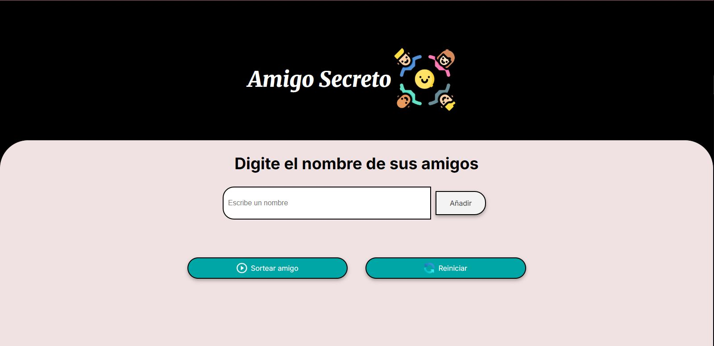

# 🎁 Amigo Secreto 

Una aplicación divertida y sencilla para sortear amigos en tu grupo de forma aleatoria. Ideal para jugar al clásico "Amigo Secreto" o "Amigo Invisible".

##  Características

- Permite **ingresar múltiples nombres** de amigos.
- Una vez que hay al menos **dos personas añadidas**, puedes realizar el **sorteo**.
- Puedes **reiniciar el juego** fácilmente si quieres empezar desde cero.

## Vista previa

 <!-- Reemplaza con la ruta real de tu imagen -->

## Cómo usar

1. Clona este repositorio:
   ```bash
   git clone https://github.com/valeepg/amigo-secreto.git
   cd amigo-secreto
